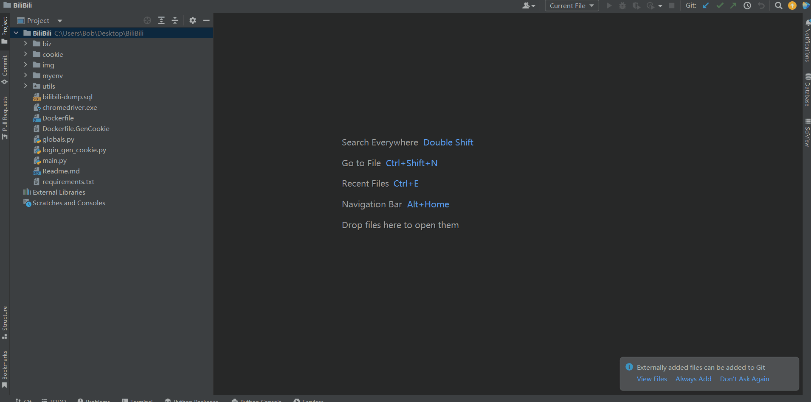
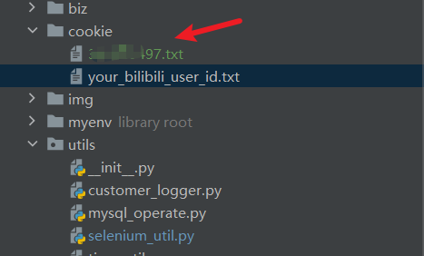

# B站抽奖转发——薅羊毛脚本

## 简介

常刷B站的伙伴们，是不是每次看到Up主的抽奖活动都行动不已，毕竟`抽奖总得试试吗，万一中奖了呢`，然后一波关注+转发之后，迎来的每每都是`从不缺席，从不中奖`。

So，如果有个小脚本能够帮助你去看看**今天有哪些Up有抽奖活动，然后还能帮助你自动进行抽奖（转发动态+关注）**，那么你是不是可以花更多时间去看看二次元动漫呀。本着有羊毛一起薅的想法，我做了一个B站自动抽奖活动转发的小脚本，帮助伙伴们自动参与Up主的活动转发，提高伙伴们的中奖率，同时还能解放大家的双手，开开心心薅羊毛。

本薅羊毛脚本，虽然目前只是一个V0的脚本，但是已经正常运转几个月了，我也薅到了一点儿羊毛啦，下面就来看看它是怎么玩的吧。

**声明**: <u>**此脚本仅用于学习和测试，作者本人并不对其负责，请于运行测试完成后自行删除，请勿滥用！**</u>

## 效果

本程序内置一个扫描脚本，该脚本去挖掘那些经常转发抽奖动态的伙伴，然后每天定时去扫描他们今天的动态信息，随后再利用一个抽奖动态识别与转发脚本来进行活动参与，转发后的效果是这样的：


## docker部署

### 1.准备工作【以后更新版本不需要这个步骤】

#### 1.1 创建数据库

在MySQL5.7版本以上数据库执行下面的脚本：`init_db_script.sql`

#### 1.2 创建selenium环境

```dockerfile
docker run -d -p 5555:4444 -p 7900:7900 --shm-size="1g" -e SE_NODE_MAX_SESSIONS=5 -e SE_NODE_MAX_INSTANCES=5 selenium/standalone-chrome:latest
```

可以访问 [your_ip:5555]()，如果出现下面的界面，说明selenium环境创建成功


#### 1.3 修改个人配置

在`globals.py`文件中，修改数据库，服务器IP信息


### 2.启动程序

#### 2.1 启动生成Cookie的脚本

##### 2.1.1 构建镜像

```dockerfile
docker build -t bilibili_gen_cookie -f Dockerfile.GenCookie .
```

##### 2.1.2 启动容器

```dockerfile
docker run bilibili_gen_cookie
```

##### 2.1.3 扫码登录

访问 [your_ip:5555]()，扫码登录,自动生成Cookie


##### 2.1.4 检查Cookie

到项目所在文件夹，查看是否生成Cookie


#### 2.2 启动转发动态脚本

##### 2.2.1 构建镜像

```java
docker build -t bilibili_dynamic_share .
```

##### 2.2.2 运行镜像

```java
docker run bilibili_dynamic_share
```

## 本地调试代码

### 准备工作

#### 下载驱动

下载浏览器驱动chromedriver.exe，**注意：chromedriver.exe的版本关系需要选择与你当前Chrome版本最接近的**

点击下面的连接进行下载：

[Click me ：chromedriver下载地址](http://chromedriver.storage.googleapis.com/index.html)

<u>例如：</u>

| 你的Chrome版本                                               | 你可以下载的chromedriver.exe版本                             |
| ------------------------------------------------------------ | ------------------------------------------------------------ |
|  |  |

将下载后的chromedriver.exe放置到项目中，覆盖项目中原有的chromedriver.exe。

#### 创建数据库

在MySQL5.7版本以上数据库执行下面的脚本：`init_db_script.sql`

#### 修改个人配置

在`globals.py`文件中，修改数据库，服务器IP信息（这里可以不用设置）


### 调试步骤

打开下面这个目录代码： `\utils\selenium_util.py`

可以看到里面有2个init_webdriver方法，注释掉第一段用于服务器部署的代码，选择第二段用于本地调试的init_webdriver方法。

```python

def init_webdriver():
    """
    初始化Selenium信息———— 此为服务器版本，用于部署使用
    :return:
    """
    # 设置浏览器信息
    chrome_options = webdriver.ChromeOptions()
    # chrome_options.add_argument("--headless")  # 以无头模式运行Chrome
    chrome_options.add_argument("--no-sandbox")  # 取消沙盒模式
    chrome_options.add_argument('lang=zh_CN.UTF-8')
    chrome_options.add_argument(
        '--user-agent=Mozilla/5.0 (Macintosh; Intel Mac OS X 10_15_7) AppleWebKit/537.36 (KHTML, like Gecko) '
        'Chrome/101.0.4951.64 Safari/537.36')  # 替换User-Agent
    driver = webdriver.Remote(
        command_executor=globals.selenium_url,
        options=chrome_options
    )
    chains = ActionChains(driver)
    return driver, chains


# def init_webdriver():
#     """
#     作用和上面的相同，都是用于初始化Selenium
#     此段代码用于在本地调试使用，注意：请根据Readme.md文档到指定位置下载与当前Chrome浏览器匹配的chromedriver.exe
#     :return:
#     """
#     chrome_options = Options()
#     option = ChromeOptions()
#     option.add_experimental_option('excludeSwitches', ['enable-automation'])
#     s = Service(r"../chromedriver.exe")
#     bro = webdriver.Chrome(service=s, chrome_options=chrome_options, options=option)
#     chains = ActionChains(bro)
#     return bro, chains
```

#### 切换到虚拟环境

代码中已经有一个虚拟环境myenv.rar，将其解压到到项目，然后在Pycharm中按下 `Ctrl + Alt + S` 进入设置界面，然后按照下面的设置过程：



#### 登录生成Cookie

先登录生成Cookie的原因是为了方便后面其他功能的调试，因为后面搜索、转发等功能都是在登录基础上做的。

具体的生成Cookie方式，参考如下步骤：**<u>扫码登录、扫码登录、扫码登录</u>**


如下图可以看到，已经生成了Cookie：



## TODO

- [x] 项目采用Docker部署
- [x] 扫描B站二维码登录B站，自动生成Cookie并保存到本地项目文件夹cookie中
- [x] 登录过期，使用Cookie续期
- [ ] 每日任务执行情况推送（之前用的方糖酱，后续将重新加入）
- [ ] 将数据库搭建的工作使用Docker部署
- [ ] 过期动态的删除
- [ ] 接入B站UP主每日总结的抽奖动态列表，自动完成对其转发

---

### 本程序仅用于学习，有问题欢迎大家提Issue，有时间我会帮忙解决，也请大佬有好的解决方案在Issue上分享哈:smile::smile::smile:
